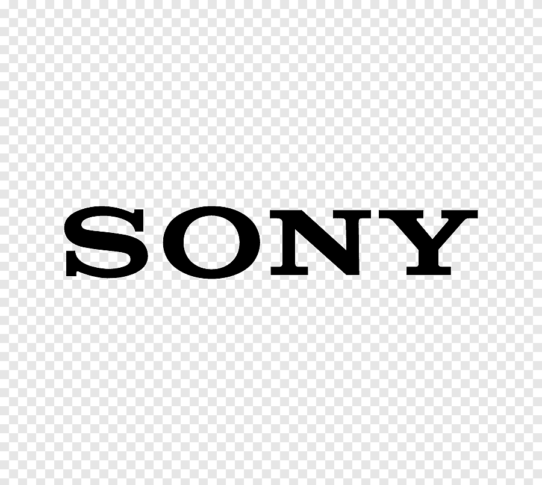
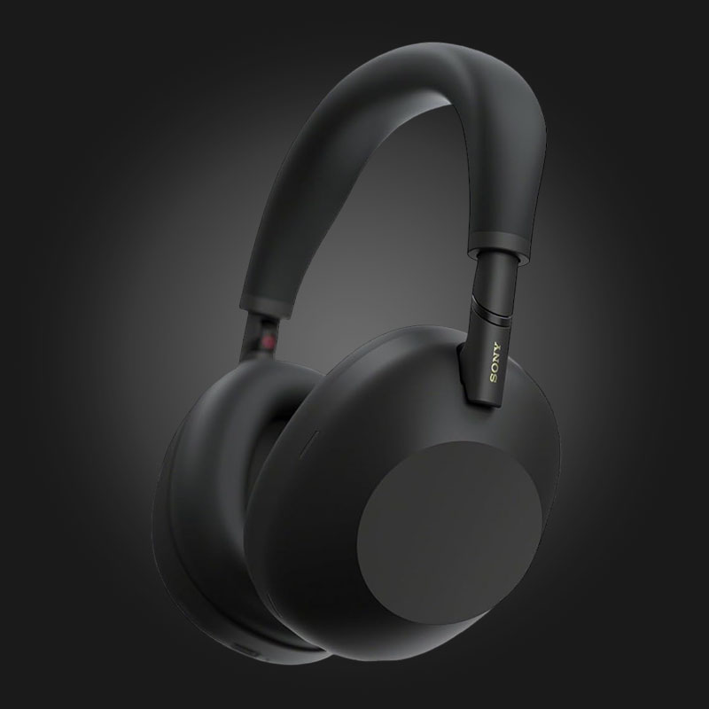

<p align="center">
  
</p>

<h1 align="center">WH-1000XM6 · Rediseño web cinematográfico</h1>

<p align="center">
  Experiencia visual interactiva para los auriculares flagship de Sony.<br/>
  Scroll narrativo · 145 frames · Next.js 14 · Framer Motion · Tailwind CSS
</p>

---

<p align="center">
  
</p>

## Qué es esto

Una reinterpretación visual completa de la landing de producto de los Sony WH-1000XM6.

No quería hacer una página "bonita" sin más. Quería construir algo con presencia real, ritmo, narrativa y una dirección visual más cercana a una pieza de cine de producto que a una ficha comercial genérica.

El resultado es una experiencia con scroll cinematográfico, 145 frames sincronizados en canvas, glassmorphism con intención, y un nivel de detalle que se nota en cada transición.

## Objetivo del proyecto

- **Sensación premium sin trampas** — Dirección visual con peso, contraste y presencia. Nada de cristales decorativos porque sí.
- **Narrativa por secciones** — Cada bloque cuenta una parte del producto: impacto inicial, ingeniería, cancelación de ruido, sonido, experiencia de uso y cierre personal.
- **Movimiento con intención** — Microinteracciones, parallax controlado y una secuencia de frames ligada al scroll que refuerza la sensación de producto vivo.
- **Material visual real** — Fotografías de producto propias, renders y vídeo integrado. Sin placeholders, sin genéricos.

## Galería

<table>
  <tr>
    <td></td>
    <td></td>
  </tr>
  <tr>
    <td></td>
    <td></td>
  </tr>
  <tr>
    <td colspan="2"></td>
  </tr>
</table>

## Stack técnico

| Tecnología | Uso |
|---|---|
| **Next.js 14** | App Router, export estático, estructura moderna |
| **TypeScript** | Tipado sólido en todo el proyecto |
| **Tailwind CSS** | Sistema visual propio: glass, divisores, botones premium, capas ambientales |
| **Framer Motion** | Scroll-linked animations, reveals, microinteracciones |
| **HTML5 Canvas** | Secuencia de 145 frames sincronizados al scroll a 60 fps |
| **Netlify** | Despliegue estático con headers de protección |

## Estructura del proyecto

```
app/
  page.tsx              ← Composición principal de la experiencia
  globals.css           ← Sistema visual global (glass, gradients, buttons)

components/
  Navbar.tsx            ← Navegación flotante editorial
  IntroOverlay.tsx      ← Pantalla de carga cinematográfica
  ScrollScene.tsx       ← Núcleo narrativo: canvas + beats editoriales
  FallbackDiagram.tsx   ← Fallback SVG si faltan frames
  sections/
    Hero.tsx            ← Apertura con vídeo y copy de impacto
    Showcase.tsx        ← Producto y anatomía técnica
    SilentEngineering   ← Materiales, ANC, detalle constructivo
    Specs.tsx           ← Especificaciones en grid con marquee
    Experience.tsx      ← Escenarios de uso real + vídeo
    Crafted.tsx         ← Cierre personal del creador
    Footer.tsx          ← Footer editorial con enlaces y copyright

lib/
  frames.ts             ← Config de la secuencia de imágenes del canvas

public/
  assets/               ← Fotos de producto, logos, renders y vídeos
  frames/               ← 145 fotogramas WebP para el scroll narrativo
```

## Arranque local

```bash
npm install
npm run dev
```

Accede en **http://localhost:3010**

Build de producción:

```bash
npm run build
```

## Secuencia de frames

La animación del bloque principal usa 145 frames WebP almacenados en `public/frames/`. Se pueden ajustar en `lib/frames.ts` (cantidad, formato, ruta).

## Autor

**Andrés Lorente Martínez** — Baza, Granada

Desarrollo, diseño de interacción y dirección visual.

| | |
|---|---|
| **Portfolio** | [andreslorentemartinez.dev](https://andreslorentemartinez.dev) |
| **GitHub** | [Andresmartineez6](https://github.com/Andresmartineez6) |
| **Email** | [andres.martinez@impulsatelecom.com](mailto:andres.martinez@impulsatelecom.com) |

---

> Este proyecto es una pieza experimental de diseño y desarrollo frontend. No es una web oficial de Sony ni pretende representar material comercial de la marca.
